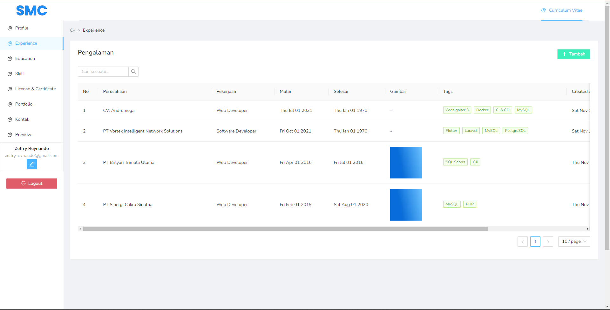
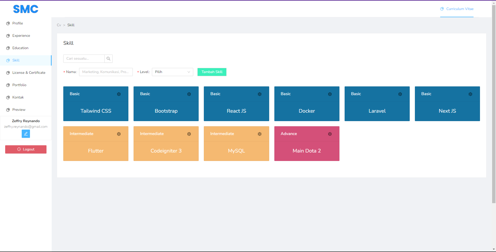
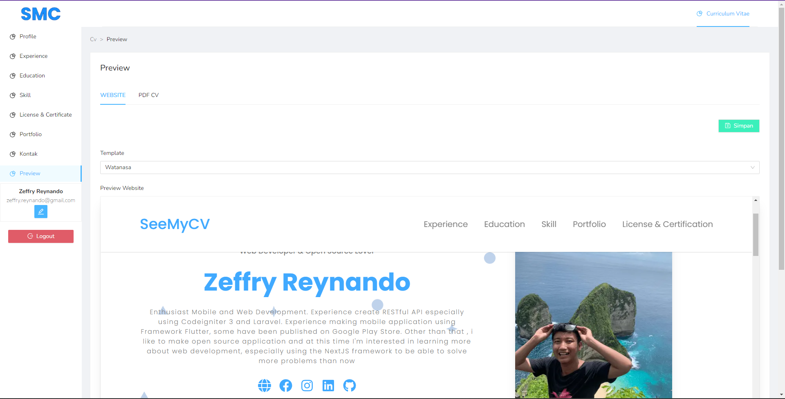
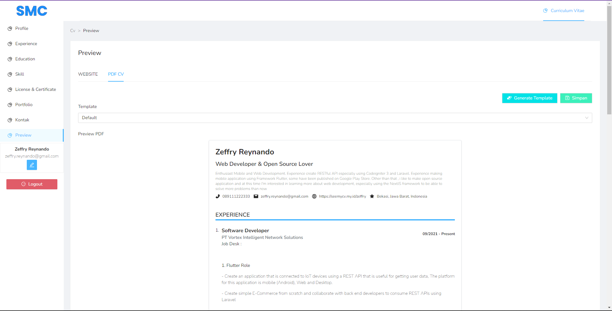

# Admin SeeMyCV

Website Admin to manage SeeMyCV User 

## Tech Stack

**Client:** React, NextJS, Ant Design, TailwindCSS

**Server:** Node, KoaJS

## Installation

1. `npm install`
2. `cp .env.example .env.development` && `cp .env.example .env.production`
3. `npm run dev`
4. Access server development at `localhost:3000`

## Features

- Modul Setting
- Modul Curriculum Vitae
    - Profile
    - Experience
    - Education
    - Skill
    - License & Certificate
    - Portfolio
    - Preview
        - Website
        - Generate PDF

## Demo

### Experience Page

### Skill Page

### Preview Website Page

### Preview PDF Builder Page

## Related

Here are some related projects

[SeeMyCV](https://github.com/zgramming/seemycv)
[API SeeMyCV](https://github.com/zgramming/api.seemycv)

## Feedback

If you have any feedback, please reach out to us at zeffry.reynando@gmail.com

## Authors

- [@zgramming](https://www.github.com/zgramming)
